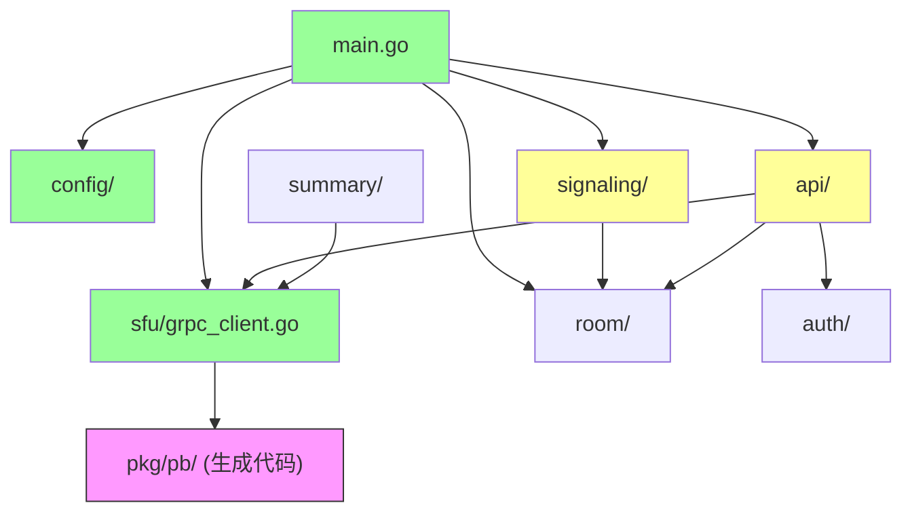

# NameCon 类图

> 版本: v1.0 | 日期: 2026-06-11

---

## 一、C++ 端 (media-svc)

### 1.1 整体类图

```mermaid
classDiagram
    direction TB

    class Singleton~T~ {
        <<template>>
        +GetInstance() shared_ptr~T~
    }

    class ConfigMgr {
        -shared_ptr~Config~ _cfg
        +Init(path) void$
        +Inst() shared_ptr~const Config~$
    }
    note for ConfigMgr "手动单例(需传路径)"

    class Config {
        +int grpc_port
        +int udp_port_start
        +int udp_port_end
        +string public_ip
        +string cert_file
        +string key_file
    }

    class GrpcServer {
        -MediaServiceImpl _service
        -unique_ptr~Server~ _server
        +GrpcServer(addr, port)
        +run() void
        +stop() void
    }

    class MediaServiceImpl {
        +CreateRoom(ctx, req, resp) Status
        +AddPeer(ctx, req, resp) Status
        +DestroyRoom(ctx, req, resp) Status
        +RemovePeer(ctx, req, resp) Status
        +SendOffer(ctx, req, resp) Status
        +SendIceCandidate(ctx, req, resp) Status
        +MuteTrack(ctx, req, resp) Status
        +GetRoomStats(ctx, req, resp) Status
    }
    MediaServiceImpl --|> MediaService::Service : 继承

    class UdpServer {
        -io_context& _ioc
        -udp::socket _socket
        +UdpServer(ioc, port_start, port_end)
        +asyncReceive(callback) void
        +sendTo(data, endpoint) void
    }

    class DtlsContext {
        -SSL_CTX* _ctx
        +DtlsContext()
        +doHandshake(data, endpoint) void
        +exportSrtpKeys() SrtpKeys
    }

    class SrtpContext {
        -srtp_t _srtpIn
        -srtp_t _srtpOut
        +protect(data, len) bytes
        +unprotect(data, len) bytes
    }

    class Peer {
        +string peerId
        +string roomId
        +uint32_t audioSSRC
        +uint32_t videoSSRC
        +udp::endpoint remoteEp
        -DtlsContext _dtls
        -SrtpContext _srtp
        +initDtls() void
        +handleDtlsPacket(data) void
    }

    class Room {
        +string roomId
        -vector~string~ _peerIds
        +addPeer(peerId) void
        +removePeer(peerId) void
    }

    class RouteTable {
        -map~uint32_t, string~ _ssrcToPeer
        +lookup(ssrc) string
        +insert(ssrc, peerId) void
        +remove(ssrc) void
    }

    class Router {
        -UdpServer _udp
        -RouteTable _table
        -map~string, Peer~ _peers
        -map~string, Room~ _rooms
        +run() void
        +onPacket(data, ep) void
    }

    class AIPipeline {
        -bool _enabled
        +init(enabled) void
        +onAudioPacket(peerId, data, len) void
        +generateSummary() SummaryResult
    }

    GrpcServer --> ConfigMgr : 读取配置
    GrpcServer *-- MediaServiceImpl
    Router --> UdpServer
    Router --> RouteTable
    Router o-- Peer
    Router o-- Room
    Peer --> DtlsContext
    Peer --> SrtpContext
    Router --> AIPipeline
    AIPipeline ..> Singleton : 继承
```

### 1.2 已实现 vs 待实现

| 类 | 状态 | 说明 |
|----|:--:|------|
| `Singleton<T>` | ✅ | 通用单例模板 |
| `Config` / `ConfigMgr` | ✅ | YAML 配置加载 |
| `GrpcServer` | ✅ | gRPC Server 启动/停止 |
| `MediaServiceImpl` | ✅ | CreateRoom + AddPeer 实现 |
| `UdpServer` | 🔲 | Phase 2 Day 6-7 |
| `DtlsContext` | 🔲 | Phase 2 Day 8-9 |
| `SrtpContext` | 🔲 | Phase 2 Day 10-11 |
| `Router` / `Room` / `Peer` / `RouteTable` | 🔲 | Phase 2 Day 12 |
| `Forwarder` | 🔲 | Phase 2 Day 12 |
| `AIPipeline` / `Vad` / `Transcript` | 🔲 | Phase 3 |
| `Logger` / `Stats` | 🔲 | 工具类 |

---

## 二、Go 端 (signal-svc)

### 2.1 模块依赖图



### 2.2 Go 模块说明

| 模块 | 核心类型 | 职责 |
|------|---------|------|
| `config/` | `Config`, `ServerConfig` | YAML 配置加载 |
| `sfu/` | `Client` | gRPC 连接管理 + RPC 调用封装 |
| `signaling/` | `Hub`, `Client`, `Message` | WebSocket 连接管理 + 消息路由 |
| `api/` | HTTP handlers | REST API |
| `room/` | `Room`, `Participant`, `Manager` | 房间实体与生命周期 |
| `auth/` | JWT 函数 | Token 生成与验证 |
| `store/` | `Store` interface, `MemoryStore` | 数据存储（接口+内存实现） |
| `summary/` | 待实现 | AI 总结服务 |
| `pkg/pb/` | 生成代码 | protobuf 序列化 + gRPC stub |
