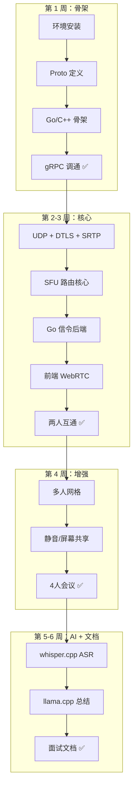

# NameCon 开发流程

> 从零到一，逐步构建 WebRTC SFU 视频会议系统

---

## 环境要求

| 工具/库 | 最低版本 | 当前环境 | 安装方式 |
|---------|---------|---------|---------|
| Ubuntu | 22.04+ | 24.04.3 | — |
| GCC/G++ | 11+ (C++17) | 13.3.0 | `apt install build-essential` |
| CMake | 3.20+ | 3.28.3 | `apt install cmake` |
| Go | 1.22+ | 1.22.2 | `apt install golang-go` |
| Node.js | 16+ | 18.19.1 | `apt install nodejs npm` |
| Boost (asio) | 1.83+ | 1.83.0 | `apt install libboost-dev` |
| OpenSSL | 3.0+ | 3.0.13 | 系统自带 |
| libsrtp2 | 2.5+ | 2.5.0 | `apt install libsrtp2-dev` |
| spdlog | 1.12+ | 1.12.0 | `apt install libspdlog-dev` |
| gRPC C++ | 1.51+ | 1.51.1 | `apt install libgrpc++-dev libprotobuf-dev` |
| Protobuf | 3.21+ | 3.21.12 | `apt install protobuf-compiler-grpc` |
| Docker | 20+ | 29.1.3 | `apt install docker.io` |

### 一键安装

```bash
# 系统库 + 编译工具 + 所有 C++ 依赖
sudo apt install -y \
    build-essential cmake pkg-config \
    libboost-dev libsrtp2-dev libspdlog-dev \
    libgrpc++-dev libprotobuf-dev protobuf-compiler-grpc \
    golang-go nodejs npm docker.io

# Go protobuf 插件（国内设置代理）
export GOPROXY=https://goproxy.cn,direct
go install google.golang.org/protobuf/cmd/protoc-gen-go@latest
go install google.golang.org/grpc/cmd/protoc-gen-go-grpc@latest

# 添加到 PATH
echo 'export PATH=$PATH:$(go env GOPATH)/bin' >> ~/.bashrc
source ~/.bashrc
```

### 验证安装

```bash
# 一键自检
gcc --version && cmake --version && go version && node --version
protoc --version && which protoc-gen-go && which grpc_cpp_plugin
pkg-config --modversion grpc++ && pkg-config --modversion protobuf
docker --version
```

---

## Phase 1 — 项目骨架搭建（第 1 周）

> **目标**：跑通构建系统，Go ↔ C++ gRPC 通信链路

### Day 1：环境就绪

- [ ] 安装所有系统依赖
- [ ] 验证 protoc / protoc-gen-go / protoc-gen-go-grpc / grpc_cpp_plugin 可用
- [ ] 验证 Docker 可用（`docker run hello-world`）

### Day 1-2：项目目录结构

创建项目骨架：

```
namecon/
├── proto/media/media.proto      # gRPC 协议定义
├── configs/
│   ├── signal-svc.yaml           # Go 信令配置
│   └── media-svc.yaml            # C++ 媒体配置
├── scripts/
│   ├── gen_proto.sh              # Proto 代码生成
│   ├── build.sh                  # 编译所有模块
│   └── dev.sh                    # 开发环境启动
├── Makefile                      # 顶层构建
├── docker-compose.yml            # 容器编排
│
├── signal-svc/                   # Go 信令服务
│   ├── go.mod
│   ├── main.go
│   └── internal/
│       ├── config/
│       ├── api/
│       ├── signaling/
│       ├── room/
│       ├── sfu/
│       └── auth/
│
├── media-svc/                    # C++ 媒体服务
│   ├── CMakeLists.txt
│   ├── main.cpp
│   └── transport/
│       ├── udp_server.h/.cpp
│       ├── dtls_context.h/.cpp
│       └── srtp_context.h/.cpp
│
└── web/                          # 前端
    ├── index.html
    ├── room.html
    ├── css/style.css
    └── js/
        ├── api.js
        ├── signaling.js
        ├── webrtc.js
        └── ui.js
```

### Day 2：Proto 定义

编写 `proto/media/media.proto`：

```protobuf
syntax = "proto3";
package media;

service MediaService {
  rpc CreateRoom(CreateRoomReq) returns (CreateRoomResp);
  rpc DestroyRoom(DestroyRoomReq) returns (DestroyRoomResp);
  rpc AddPeer(AddPeerReq) returns (AddPeerResp);
  rpc RemovePeer(RemovePeerReq) returns (RemovePeerResp);
  rpc SendOffer(SendOfferReq) returns (SendOfferResp);
  rpc SendIceCandidate(SendIceCandidateReq) returns (SendIceCandidateResp);
  rpc MuteTrack(MuteTrackReq) returns (MuteTrackResp);
  rpc GetRoomStats(RoomStatsReq) returns (RoomStatsResp);
}
```

编写 `scripts/gen_proto.sh`，验证能生成 Go + C++ 代码。

### Day 3：Go + C++ 骨架

- Go：初始化 `go.mod`，加载 YAML 配置，打印 `signal-svc started`
- C++：`CMakeLists.txt` 配置 gRPC/Protobuf 依赖，加载 YAML 配置，打印 `media-svc started`

### Day 4：gRPC 打通

- C++ 启动 gRPC Server（所有方法返回空响应）
- Go 创建 gRPC Client，调用 `CreateRoom` 往返成功

### Day 5：构建系统

- 编写 `Makefile`（`make build` / `make clean` / `make run`）
- 编写 `scripts/build.sh`
- 编写 `scripts/dev.sh`

**验收标准**：
```bash
make build        # 无报错
./scripts/dev.sh  # 两个服务启动，gRPC 调通
```

---

## Phase 2 — 核心功能实现（第 2~3 周）

> **目标**：两人互通音视频

### Day 6-7：C++ UDP Server

```
文件：media-svc/transport/udp_server.h/.cpp
依赖：boost::asio

功能：
  - 绑定 UDP 端口，异步收发
  - 管理多个 remote endpoint
  - 非阻塞 recv/send
```

### Day 8-9：C++ DTLS 握手

```
文件：media-svc/transport/dtls_context.h/.cpp
依赖：OpenSSL 3.0+

流程：
  1. 生成自签证书（启动时）
  2. 对每个 Peer 创建 SSL_CTX
  3. DTLS handshake（通过 UDP 交换握手包）
  4. 导出 SRTP 密钥材料
```

### Day 10-11：C++ SRTP 加解密

```
文件：media-svc/transport/srtp_context.h/.cpp
依赖：libsrtp2

封装：
  - srtp_protect() → RTP 包加密
  - srtp_unprotect() → RTP 包解密
  - 每个 Peer 独立的 SRTP 上下文
```

### Day 12：SFU 路由核心

```
文件：media-svc/sfu/router.h/.cpp
      media-svc/sfu/room.h/.cpp
      media-svc/sfu/peer.h/.cpp
      media-svc/sfu/route_table.h/.cpp

核心数据结构（全部 O(1)）：
  ssrcToPeer_  : SSRC → PeerId
  peerTable_   : PeerId → PeerInfo（密钥/SSRC/地址）
  roomPeers_   : RoomId → [PeerId...]

主循环：收包 → SRTP解密 → 读RTP头(12字节) → 查表 → SRTP重加密 → 转发
```

### Day 13：C++ gRPC Service 实现

```
文件：media-svc/grpc/media_service.h/.cpp

实现所有 gRPC 方法：
  CreateRoom → SFU 内部分配房间
  AddPeer    → SFU 分配端口，创建 DTLS/SRTP 上下文
  SendOffer  → 解析 SDP，生成 answer
  RemovePeer → 清理 Peer 资源
```

### Day 14：Go 后端

- REST API：房间 CRUD、Token 签发
- WebSocket Hub：连接管理、消息路由
- 房间状态：内存存储（Room + Participants）

### Day 15：Go ↔ C++ gRPC Adapter

```
文件：signal-svc/internal/sfu/adapter.go

Go 信令操作 → gRPC 请求：
  CreateRoom → gRPC CreateRoom
  UserJoin   → gRPC AddPeer
  SDP Offer  → gRPC SendOffer
```

### Day 16-18：前端

- `index.html`：创建/加入房间界面
- `room.html`：视频网格 + 控制栏
- `api.js`：REST API 调用
- `signaling.js`：WebSocket 信令
- `webrtc.js`：PeerConnection 管理

### Day 19-21：联调

- 浏览器 A ↔ SFU ↔ 浏览器 B
- 处理 ICE 连接状态
- 音视频同步确认

**验收标准**：两个浏览器标签页互相看到听到 ✅

---

## Phase 3 — 多人会议 + 增强（第 4 周）

> **目标**：多人会议 + 屏幕共享 + 控制

### Day 22-23：多人视频网格

- 前端自适应布局（2×2 / 3×3 / 4×4）
- 按加入顺序排列视频块

### Day 24：静音/关闭摄像头

- WebSocket `mute` 消息
- gRPC `MuteTrack` → SFU 停止转发对应 SSRC

### Day 25：屏幕共享

- `getDisplayMedia()` 获取屏幕流
- 独立 video SSRC，标记为 screenshare track
- SFU 转发逻辑与摄像头流一致

### Day 26-28：联调 + 修复

**验收标准**：4 人会议 + 屏幕共享 ✅

---

## Phase 4 — AI 总结 + 文档（第 5~6 周）

> **目标**：AI 对话总结 + 面试准备

### Day 29-31：AI Pipeline 空壳

```
文件：media-svc/ai/pipeline.h/.cpp
      media-svc/ai/vad.h/.cpp
      media-svc/ai/transcript.h/.cpp

空壳实现：
  - onAudioPacket() 收到包但暂不处理
  - generateSummary() 返回空结果
  - 不影响现有音视频通话
```

### Day 32-34：ASR 集成

- 集成 whisper.cpp（tiny 模型，~75MB）
- Opus 解码 → PCM → whisper 流式转录
- 按 PeerId 分组存储转录文本

### Day 35-36：LLM 总结

- 集成 llama.cpp（Qwen2.5-1.5B INT4，~1GB）
- 定时/手动/终场三种触发模式
- 输出结构化 JSON：`{title, overview, keyPoints[], actionItems[]}`

### Day 37-38：前后端打通

- Go Summary Service：触发 → gRPC 调用 C++ → 接收结果
- WebSocket 推送总结给所有客户端
- 前端 `summary.js`：展示总结面板

### Day 39-42：文档

- `docs/architecture.md`：架构图 + 序列图
- `docs/protocol.md`：信令协议详细说明
- `docs/interview.md`：面试准备要点（自述话术 + 必问清单）

**验收标准**：讨论 5 分钟后自动生成结构化总结 ✅

---

## 开发顺序图



---

## 风险提示

| 风险 | 等级 | 应对 |
|------|:--:|------|
| DTLS 握手调试困难 | 🔴 | 用 `chrome://webrtc-internals/` 观察 ICE 状态；Wireshark 抓包分析 |
| 浏览器仅 HTTPS 下可用 getUserMedia | 🟡 | `localhost` 是特例，HTTP 也能用；或 `python3 -m http.server 3000` |
| gRPC 源码编译耗时 | 🟢 | 直接用 apt 版本（1.51），功能完全满足 |
| 网络访问 GitHub 超时 | 🟡 | Go 代理：`GOPROXY=https://goproxy.cn,direct`；git clone 用镜像 |
| AI 模型下载 | 🟡 | whisper tiny 75MB，Qwen2.5-1.5B INT4 ~1GB，提前下载 |

---

## 面试自述话术模板

> "我做的是一个轻量级 WebRTC SFU 视频会议系统，叫 NameCon。
> 后端是 Go + C++ 微服务架构：Go 负责信令调度和房间管理，C++ 负责媒体流的 DTLS 握手、SRTP 加解密和选择性转发。
> SFU 核心是零拷贝路由——只读 RTP 包头的 12 字节，不解码视频载荷，三张哈希表实现 O(1) 的 SSRC → 房间 → 参会者映射。
> 还预留了 AI 对话总结的扩展位，基于 whisper.cpp + llama.cpp 做实时语音转写和 LLM 总结。"
